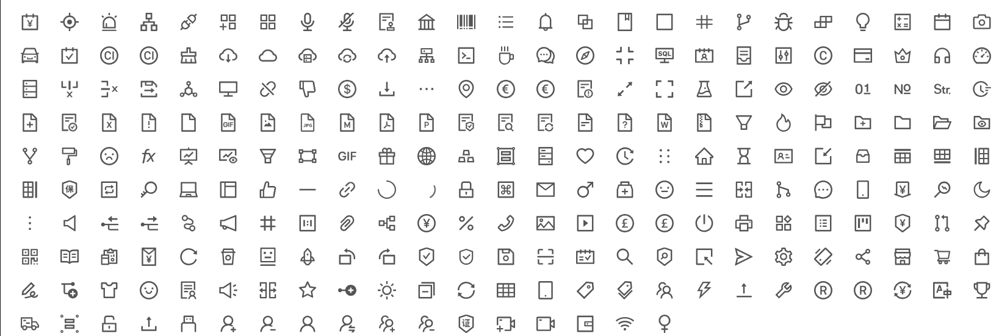

<h1 align="center">AntDesign Icons for Blazor</h1>

<div align="center">
  
</div>

## How it works?

Generate Icon components from official ant-design-icons repo with Source Generators.

You can add all icons from https://ant.design/components/icon

## Usage

- Install package
  ```bash
  $ dotnet add package AntDesign.Icons
  ```

- Add `@using AntDesign.Icons` to your `_Imports.razor` file

- We offer two ways to use it.  

  1. One is the component approach, which can be placed anywhere in the razor template. 

    ```razor
    <TagTwotone TwoToneColor="@(["red","yellow"])" />
    ```

  2. The other is the static method approach, which returns RenderFargment that can be used as an attribute value or as a variable.
  
    ```razor
    @AlertTwotone.RenderIcon(twoToneColor:["#52c41a", "#398439"])
    ```

  They have the same parameters and achieve the same functionality.


### Parameters

## API

| Property | Description | Type | Default Value |
| --- | --- | --- | --- |
| Class | class Name of Icon |string         | -         |
| Style   | Style properties of icon, like fontSize and color| string       |
| Spin | Rotate icon with animation | boolean         |-       |
| Rotate |Rotate by n degrees | int  | -  |
| TwoToneColor |Only supports the two-tone icon. Specify the primary color.| string[]  | -  |


## Development

- Install the .NET Compiler Platform SDK with VS2022 for debug the Source Generators.
- Set `AntDesign.Icons.Generator` as startup project.
- Press F5 or click `Debug` button on top of VS2022.
